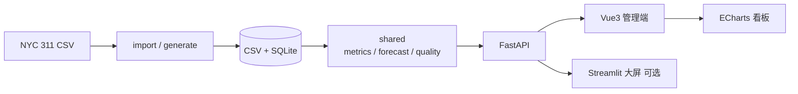

# 智慧政务大数据分析平台

基于 **NYC 311** 公开热线数据的政务场景作品集：数据接入清洗 → 多维聚合 → 趋势预测 / 质量监控 → 可视化看板。  
适合作为**数据分析**方向的项目。

| 项 | 内容 |
| --- | --- |
| 数据规模 | 诉求 **50,000** + 办件 **50,000**（约 50 天窗口） |
| 核心分析 | Holt-Winters 预测 · 3-sigma 异常检测 · Data Quality |
| 演示指标 | MAPE ≈ **16.5%** · RMSE ≈ **329** · 完整度 **99.36%** |
| 技术栈 | Python · Pandas · FastAPI · Vue3 · ECharts · SQLite · Docker |
| 一键部署 | `docker compose up -d --build` |

---

## 目录

1. [功能预览](#1-功能预览)
2. [数据一览](#2-数据一览)
3. [系统架构](#3-系统架构)
4. [核心能力](#4-核心能力)
5. [快速启动](#5-快速启动)
6. [Docker 部署](#6-docker-部署)
7. [权限与测试](#7-权限与测试)
8. [项目结构](#8-项目结构)
9. [相关文档](#9-相关文档)

---

## 1. 功能预览

| 登录页 | 政府首页看板 |
| :---: | :---: |
|  |  |
| 账号登录 / 角色分流 | KPI · 趋势 · 区域 · 热门事项 |

| 诉求工单处置 | 趋势预测 |
| :---: | :---: |
|  |  |
| 筛选 · 列表 · 处置流转 | Holt-Winters · MAPE / RMSE |

---

## 2. 数据一览

数据来源：[NYC 311 Open Data](https://www.kaggle.com/datasets/sherinclaudia/nyc311-2010)，经 `import_nyc311.py` 映射为诉求 / 办件 / 部门 / 区域表，落盘 **CSV + SQLite**。

### 2.1 规模与质量

| 指标 | 数值 | 说明 |
| --- | --- | --- |
| 诉求 / 办件 | 各 50,000 | 可复现抽样演示集 |
| 时间跨度 | 约 50 天 | 2026-07-19 → 2026-09-07 |
| 办结率 | ≈ 99.45% | 已办结 49,725 / 办理中 275 |
| 数据完整度 | 99.36% | Data Quality 模块输出 |
| Unspecified 区域 | 320 条 | 待区域字典补齐 |
| 重复诉求 | 9 条 | 内容 + 分类 + 区域 + 时间全同 |

### 2.2 区域分布（办件量）

| 行政区 | 办件量 | 占比约 |
| --- | ---: | ---: |
| 布鲁克林区 | 17,032 | 34.1% |
| 皇后区 | 14,137 | 28.3% |
| 曼哈顿区 | 10,087 | 20.2% |
| 布朗克斯区 | 6,107 | 12.2% |
| 史泰登岛区 | 2,317 | 4.6% |
| Unspecified | 320 | 0.6% |

### 2.3 头部诉求类型 Top 5

| 类型 | 数量 |
| --- | ---: |
| 堵塞车道 | 15,800 |
| 违章停车 | 14,352 |
| 商业噪音 | 6,643 |
| 街道噪音 | 4,291 |
| 废弃车辆 | 3,000 |

### 2.4 预测与业务 KPI

| 项 | 数值 |
| --- | --- |
| 模型 | Holt-Winters 加法季节，周期 7 天 |
| 窗口 | 回看 28 天，预测未来 7 天 |
| MAPE | ≈ 16.5% |
| RMSE | ≈ 329 |
| 近 7 日均办时长 | ≈ 4.1 小时 |
| 满意度 | ≈ 4.0 / 5 分 |

> 以上指标来自 NYC 311 约 5 万条抽样演示集。仓库默认不上传 `data/`，本地需运行接入脚本或 `generate_data.py`；纯模拟数据下区域分布 / MAPE 等会不同。更换 `days_back` 时 MAPE / RMSE 也会变化。

---

## 3. 系统架构



| 模块 | 目录 | 技术栈 | 职责 |
| --- | --- | --- | --- |
| 共享分析层 | [`shared/`](shared) | Pandas · NumPy | KPI、预测、质量、工单状态机 |
| 后端 API | [`backend/`](backend) | FastAPI · SQLite | 鉴权 RBAC、聚合接口、工单 |
| 管理前端 | [`frontend/`](frontend) | Vue3 · Element Plus · ECharts | 政府看板 / 工单 / 趋势 |
| 分析大屏 | [`dashboard/`](dashboard) | Streamlit | 只读可视化（可选） |
| 测试 | [`tests/`](tests) | pytest | 单测与 API 冒烟 |

---

## 4. 核心能力

| 能力 | 做法 | 产出 |
| --- | --- | --- |
| ETL / 映射 | NYC 字段 → 诉求 / 办件 / 部门 / 区域 | 可替换开放数据源 |
| 多维聚合 | 区域 × 类型 × 状态 · SQL / Pandas | 热点区与头部类型结论 |
| 时间序列预测 | Holt-Winters（纯 NumPy） | 未来 7 日办件量 + MAPE / RMSE |
| 异常检测 | 拟合残差 3-sigma | 异常日列表（避免把周末高峰误判） |
| 数据质量 | 缺失区域 / 重复 / 时间逻辑 | 完整度与问题明细 |
| 权限闭环 | PBKDF2 + HMAC Token | 未登录 401 · 越权 403 |

---

## 5. 快速启动

> Windows 上 Hyper-V 常保留部分端口段，本项目默认：**前端 5500**、**后端 8001**。

### 5.1 环境

```powershell
# 进入本仓库根目录后执行
python -m venv .venv
.\.venv\Scripts\Activate.ps1
pip install -r requirements-dev.txt
cd frontend
npm install
cd ..
```

### 5.2 数据

| 方式 | 命令 | 说明 |
| --- | --- | --- |
| 已有 `data/*.csv` | 可跳过 | 后端启动自动入库 |
| 模拟兜底 | `python generate_data.py` | 种子 42，可复现 |
| 真实 311 | `python import_nyc311.py "路径\311.csv" --sample 50000` | 推荐演示 |

### 5.3 启动服务

```powershell
# 终端 1 — 后端
.\.venv\Scripts\python.exe -m uvicorn backend.main:app --host 127.0.0.1 --port 8001 --reload

# 终端 2 — 前端
cd frontend
npm run dev
```

| 服务 | 地址 |
| --- | --- |
| 前端 | http://127.0.0.1:5500/login |
| 后端 API | http://127.0.0.1:8001 |
| Swagger | http://127.0.0.1:8001/docs |

### 5.4 演示账号

| 角色 | 账号 | 密码 | 进入后 |
| --- | --- | --- | --- |
| 管理员 | `admin` | `admin123` | 政府看板 `/home` |
| 普通用户 | `user` | `user123` | 群众端 `/citizen` |

### 5.5 数据大屏（可选）

```powershell
cd dashboard
streamlit run app.py
```

---

## 6. Docker 部署

需安装 [Docker Desktop](https://www.docker.com/products/docker-desktop/)。

```powershell
docker compose up -d --build
```

| 服务 | 地址 |
| --- | --- |
| 前端 Nginx | http://127.0.0.1:5500 |
| 后端 API | http://127.0.0.1:8001 |
| API 文档 | http://127.0.0.1:8001/docs |

| 说明 | 细节 |
| --- | --- |
| 无本地数据 | 容器自动 `generate_data.py` |
| 已有 CSV / DB | 通过 `./data` 卷挂载复用 |
| 反代 | Nginx 将 `/api` 转到 `backend:8000` |

```powershell
docker compose ps
docker compose logs -f backend
docker compose down
```

> 若项目路径含中文导致 Docker 构建异常，可在英文路径建 junction 后再 compose（例如 `C:\smart-gov-data` → 本仓库）。

---

## 7. 权限与测试

### 7.1 权限演示

| 步骤 | 操作 | 预期 |
| --- | --- | --- |
| 1 | 无 Token 访问 `/api/dashboard/stats` | **401** |
| 2 | `user` 登录后访问 `/api/users` | **403** |
| 3 | `admin` 访问用户管理 / 工单 / 日志 | **200** |

### 7.2 测试

```powershell
pip install -r requirements-dev.txt
pytest -v
```

| 范围 | 内容 |
| --- | --- |
| 单元测试 | `shared`：指标、预测、质量等 |
| API 冒烟 | 登录 · 401 · 403 · 看板 · 诉求 |
| 本地回归 | `pytest -v`（约 50+ 用例） |

---

## 8. 项目结构

```
智慧政务大数据平台/
├── backend/               # FastAPI
├── frontend/              # Vue3 管理端（5500）
├── dashboard/             # Streamlit 大屏（可选）
├── shared/                # metrics / auth / forecast / workflow
├── data/                  # CSV + SQLite（默认 gitignore）
├── tests/                 # 单元测试 + API 冒烟
├── docs/
│   ├── screenshots/       # README 截图
│   ├── 技术亮点.md
│   └── 项目故事.md
├── docker-compose.yml
├── Dockerfile.backend
├── Dockerfile.frontend
└── tests/                 # 单元测试 + API 冒烟
```
---

## 9. 相关文档

| 文档 | 说明 |
| --- | --- |
| [docs/技术亮点.md](docs/技术亮点.md) | 架构与分析设计说明 |
| [docs/项目故事.md](docs/项目故事.md) | 项目背景与 STAR 说明 |
| [docs/截图清单.md](docs/截图清单.md) | 截图文件约定 |