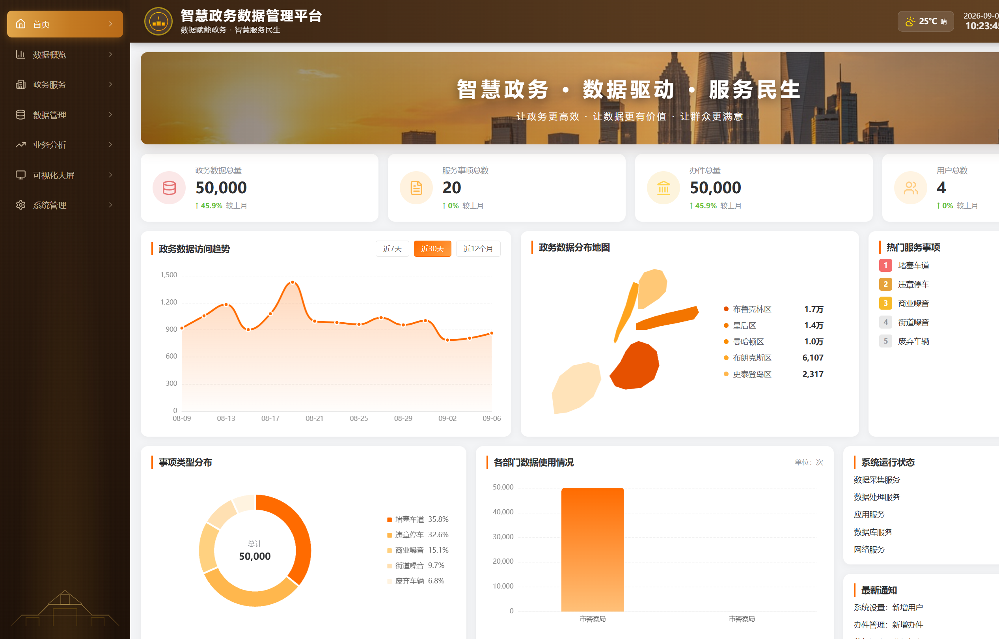
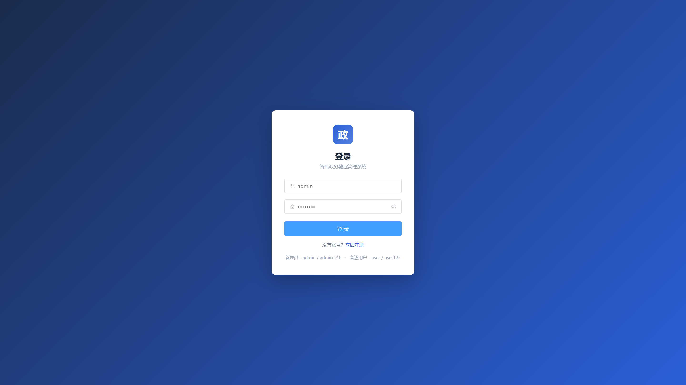
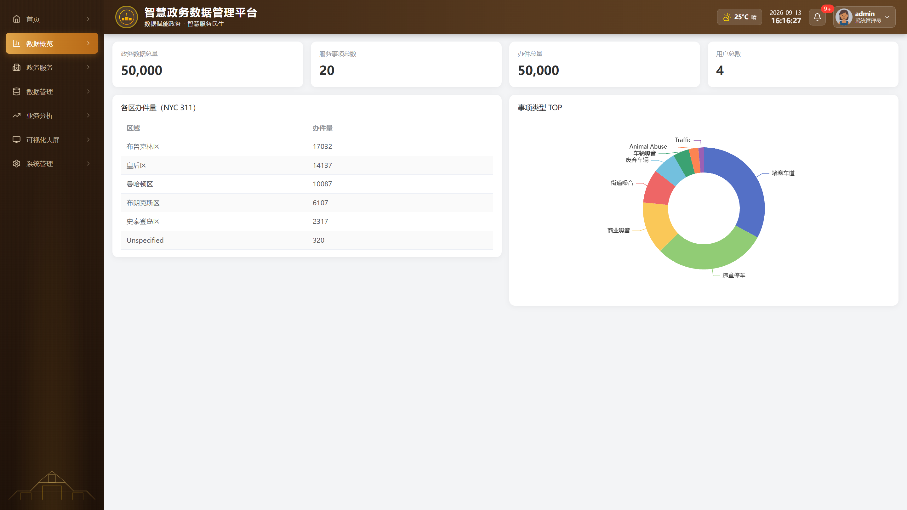
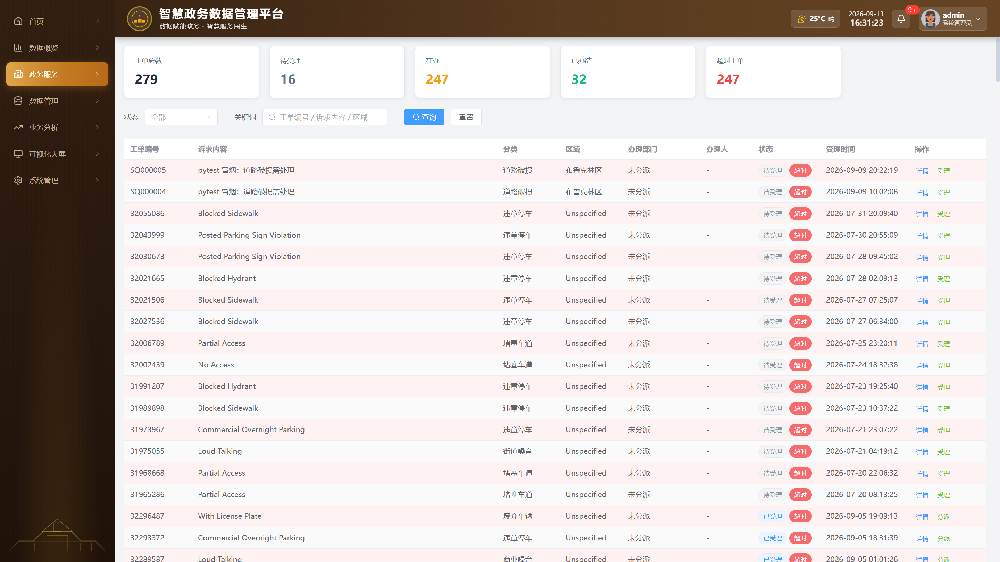
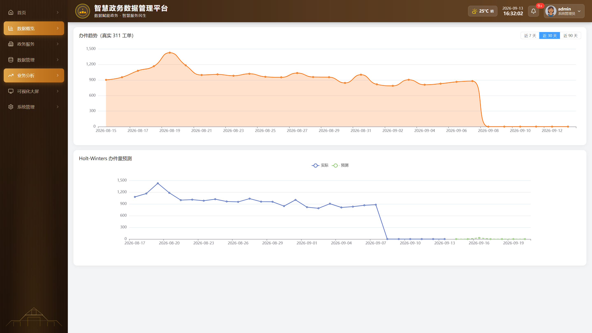
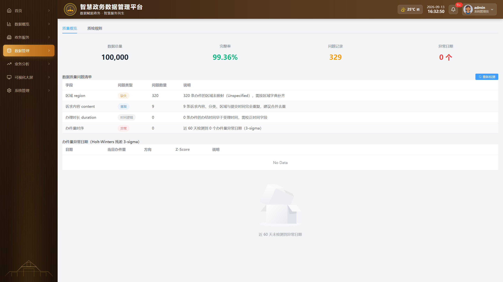
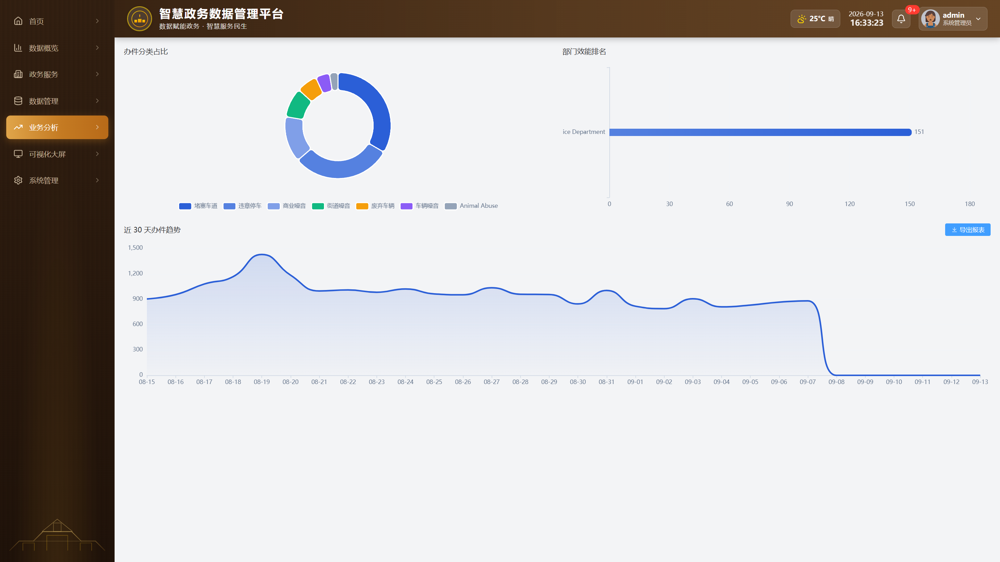
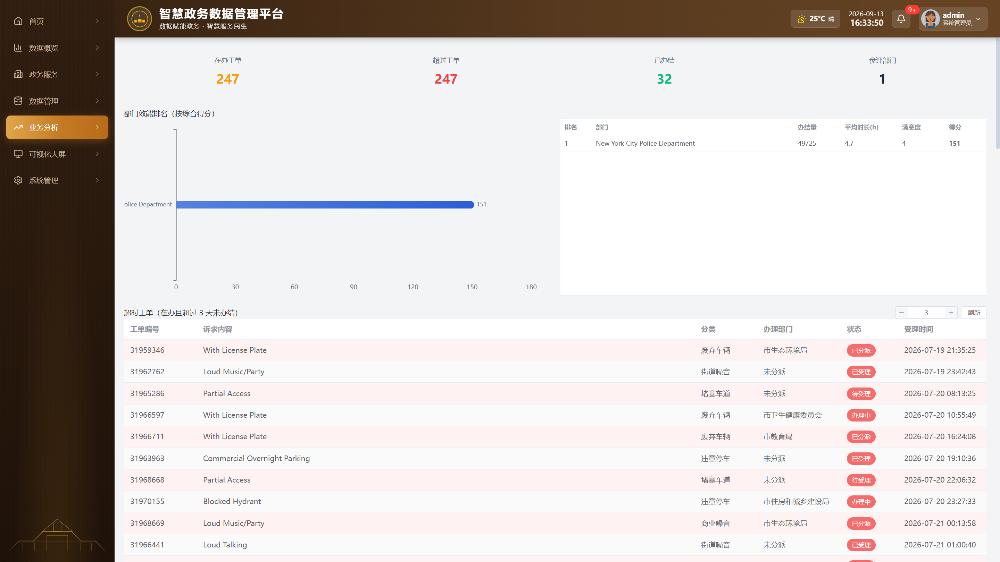
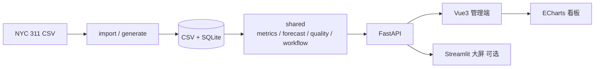

# 智慧政务数据分析平台

[](https://www.python.org/)
[](https://vuejs.org/)
[](https://fastapi.tiangolo.com/)
[](LICENSE)
[](docker-compose.yml)

基于 **NYC 311** 公开热线数据的政务场景作品集。  
覆盖完整分析链路：**数据接入 → 清洗治理 → 多维聚合 → 趋势预测 / 异常检测 → 可视化看板 → 工单闭环**。

适合作为 **数据分析 / 数据开发** 方向的面试与作品集项目。

| | |
| --- | --- |
| **数据规模** | 50,000 条 311 工单 · 映射为诉求/办件主题表 · 约 50 天窗口 |
| **分析能力** | Holt-Winters 预测 · 3-sigma 异常检测 · Data Quality |
| **演示指标** | 留出集 MAPE 14.22% · WAPE 14.01% · 完整度 99.36% |
| **工程形态** | FastAPI + Vue3 + SQLite · Docker 一键部署 · 63 pytest |

<p align="center">
  
  <br/>
  <sub>政府端首页：KPI · 趋势 · 区域分布 · 热门事项 · 类型结构</sub>
</p>

---

## 目录

- [为什么做这个项目](#为什么做这个项目)
- [功能预览](#功能预览)
- [核心能力](#核心能力)
- [数据一览](#数据一览)
- [系统架构](#系统架构)
- [快速开始](#快速开始)
- [Docker 部署](#docker-部署)
- [权限演示](#权限演示)
- [测试](#测试)
- [项目结构](#项目结构)
- [相关文档](#相关文档)
- [License](#license)

---

## 为什么做这个项目

政务热线类数据常见痛点：

1. **口径不统一**：诉求、办件、区域、状态散落在多表，难以一次看清热点。
2. **只有事后统计**：缺少短期预测与异常识别，难以及时调度资源。
3. **质量问题被忽略**：缺失区域、重复诉求会直接污染 KPI。

本项目用 **真实公开数据（NYC 311）** 模拟政务热线闭环，把「清洗 → 指标 → 预测 → 看板」做成可演示、可复现的端到端样例。

---

## 功能预览

### 登录与角色分流

系统按三类角色分流：群众进入服务端，部门人员进入所属部门工单台，超级管理员进入全局看板并只在紧急工单中介入。

| 登录页 | 政府首页看板 |
| :---: | :---: |
|  |  |
| `admin / admin123` · `user / user123` · `traffic_staff / staff123` | KPI 卡片 · 趋势 · 地图 · 热门事项 |

### 数据总览与工单处置

| 数据总览 | 诉求工单处置 |
| :---: | :---: |
|  |  |
| 各区办件量 · 事项类型 TOP | 筛选查询 · 状态流转 · 超时标红 |

### 趋势预测与数据质量

| 趋势 / Holt-Winters 预测 | 数据质量监控 |
| :---: | :---: |
|  |  |
| 回看 28 天 · 预测 7 天 · 基线对比 · 参考区间 | 完整度 · 缺失 / 重复 / 时间逻辑 · 3-sigma |

### 统计报表与督办考核

| 统计报表 | 督办考核 |
| :---: | :---: |
|  |  |
| 分类占比 · 部门效能 · 近 30 天趋势 | 在办 / 超时 · 部门得分 · 超时清单 |

---

## 核心能力

| 能力 | 做法 | 你能在界面看到什么 |
| --- | --- | --- |
| **ETL / 字段映射** | NYC 311 → 诉求 / 办件 / 部门 / 区域 | 中文区域与事项类型、可替换数据源 |
| **多维聚合** | 区域 × 类型 × 状态 · SQL / Pandas | 总览表、热门 TOP、分类饼图 |
| **时间序列预测** | Holt-Winters 加法季节，周期 7 天 | 时间留出评估 · 季节性朴素基线 · 95% 参考区间 |
| **异常检测** | 拟合残差 3-sigma | 异常日列表 / 质量页异常计数 |
| **数据质量** | 缺失区域 · 重复诉求 · 时间逻辑 | 完整度 99.36% · 问题清单 |
| **账号治理** | 群众 / 部门人员 / 超级管理员 | 部门绑定 · 持久化增改 · 即时停用 |
| **工单闭环** | 6 类业务事项 → 自动分派 → 部门办理 → 办结 | 超级管理员仅可紧急改派并填写原因 |
| **鉴权 RBAC** | 群众 / 部门人员 / 超级管理员 | 部门数据隔离 · 未登录 401 · 越权 403 |

---

## 数据一览

数据来源：[NYC 311 Open Data](https://www.kaggle.com/datasets/sherinclaudia/nyc311-2010)  
接入脚本：`import_nyc311.py` → 落盘 **CSV + SQLite**（`data/` 默认不入库，需本地生成或导入）。

### 规模与质量

| 指标 | 数值 | 说明 |
| --- | --- | --- |
| 原始工单 | 50,000 | 同一批记录映射为诉求/办件主题表，不重复计数 |
| 时间跨度 | 约 50 天 | 2026-07-19 → 2026-09-07 |
| 办结率 | ≈ 99.45% | 已办结 49,725 / 办理中 275 |
| 数据完整度 | **99.36%** | Data Quality 输出 |
| Unspecified 区域 | **320** | 待区域字典补齐 |
| 重复诉求 | **9** | 内容 + 分类 + 区域 + 时间全同 |

### 区域分布

| 行政区 | 办件量 | 占比约 |
| --- | ---: | ---: |
| 布鲁克林区 | 17,032 | 34.1% |
| 皇后区 | 14,137 | 28.3% |
| 曼哈顿区 | 10,087 | 20.2% |
| 布朗克斯区 | 6,107 | 12.2% |
| 史泰登岛区 | 2,317 | 4.6% |
| Unspecified | 320 | 0.6% |

### 头部诉求类型 Top 5

| 类型 | 数量 |
| --- | ---: |
| 堵塞车道 | 15,800 |
| 违章停车 | 14,352 |
| 商业噪音 | 6,643 |
| 街道噪音 | 4,291 |
| 废弃车辆 | 3,000 |

### 预测与业务 KPI

| 项 | 数值 |
| --- | --- |
| 模型 | Holt-Winters，周期 7 天 |
| 默认窗口 | 回看 **28** 天，预测未来 **7** 天 |
| MAPE | **14.22%**（最后 7 天时间留出集） |
| WAPE | **14.01%**（最后 7 天时间留出集） |
| MAE / RMSE | **117.98 / 139.30** |
| 近 7 日均办时长 | ≈ 4.1 小时 |
| 满意度 | ≈ 4.0 / 5 分 |

> 以上指标来自 NYC 311 约 5 万条抽样。预测误差采用最后 7 天时间留出评估；仅跑 `generate_data.py` 或更换窗口时结果会变化。紧急程度、经办人、满意度等为界面演示字段，不用于核心业务结论。

---

## 系统架构



| 模块 | 目录 | 技术栈 | 职责 |
| --- | --- | --- | --- |
| 共享分析层 | [`shared/`](shared) | Pandas · NumPy | KPI、预测、质量、工单状态机 |
| 后端 API | [`backend/`](backend) | FastAPI · SQLite | 鉴权、聚合接口、工单 |
| 管理前端 | [`frontend/`](frontend) | Vue3 · Element Plus · ECharts | 看板 / 工单 / 趋势 / 质量 |
| 分析大屏 | [`dashboard/`](dashboard) | Streamlit | 只读可视化（可选） |
| 测试 | [`tests/`](tests) | pytest | 单元测试 + API 冒烟 |

---

## 快速开始

> Windows 上 Hyper-V 常保留部分端口。本项目默认：**前端 5500**、**后端 8001**。

### 1. 环境

```powershell
# 进入本仓库根目录
python -m venv .venv
.\.venv\Scripts\Activate.ps1
pip install -r requirements-dev.txt
cd frontend
npm install
cd ..
```

### 2. 数据

| 方式 | 命令 | 说明 |
| --- | --- | --- |
| 已有 `data/*.csv` | 可跳过 | 后端启动自动入库 |
| 模拟兜底 | `python generate_data.py` | 种子 42，可复现 |
| 真实 311 | `python import_nyc311.py "路径\311.csv" --sample 50000` | 推荐演示 |

### 3. 启动

```powershell
# 终端 1 — 后端
.\.venv\Scripts\python.exe -m uvicorn backend.main:app --host 127.0.0.1 --port 8001 --reload

# 终端 2 — 前端
cd frontend
npm run dev
```

| 服务 | 地址 |
| --- | --- |
| 前端 | http://127.0.0.1:5500/login |
| 后端 API | http://127.0.0.1:8001 |
| Swagger | http://127.0.0.1:8001/docs |

### 4. 演示账号

| 角色 | 账号 | 密码 | 进入后 |
| --- | --- | --- | --- |
| 管理员 | `admin` | `admin123` | 政府看板 `/home` |
| 交通部门人员 | `traffic_staff` | `staff123` | 本部门工单 `/case` |
| 城管部门人员 | `city_staff` | `staff123` | 本部门工单 `/case` |
| 普通用户 | `user` | `user123` | 群众端 `/citizen` |

部门人员自助注册还需单位注册码（开发默认 `demo-staff-2026`）；部署时必须通过 `SMART_GOV_STAFF_REGISTER_CODE` 环境变量替换。

### 5. 数据大屏（可选）

```powershell
cd dashboard
streamlit run app.py
```

---

## Docker 部署

需安装 [Docker Desktop](https://www.docker.com/products/docker-desktop/)。

```powershell
docker compose up -d --build
```

| 服务 | 地址 |
| --- | --- |
| 前端 Nginx | http://127.0.0.1:5500 |
| 后端 API | http://127.0.0.1:8001 |
| API 文档 | http://127.0.0.1:8001/docs |

| 说明 | 细节 |
| --- | --- |
| 无本地数据 | 容器自动执行 `generate_data.py` |
| 已有 CSV / DB | 通过 `./data` 卷挂载复用 |
| 反代 | Nginx 将 `/api` 转到 `backend:8000` |

```powershell
docker compose ps
docker compose logs -f backend
docker compose down
```

> 若项目路径含中文导致 Docker 构建异常，可在英文路径建 junction 后再 compose（例如 `C:\smart-gov-data` → 本仓库）。

---

## 权限演示

| 步骤 | 操作 | 预期 |
| --- | --- | --- |
| 1 | 无 Token 访问 `/api/dashboard/stats` | **401** |
| 2 | `user` 登录后访问 `/api/users` | **403** |
| 3 | `admin` 访问用户管理 / 工单 / 日志 | **200** |

---

## 测试

```powershell
pip install -r requirements-dev.txt
pytest -v
```

| 范围 | 内容 |
| --- | --- |
| 单元测试 | `shared`：指标、预测、质量等 |
| API 冒烟 | 登录 · 401 · 403 · 看板 · 诉求 |
| 规模 | **63** 个用例 |

---

## 项目结构

```
智慧政务数据分析平台/
├── backend/                 # FastAPI
├── frontend/                # Vue3 管理端（5500）
├── dashboard/               # Streamlit 大屏（可选）
├── shared/                  # metrics / auth / forecast / workflow
├── data/                    # CSV + SQLite（gitignore）
├── tests/                   # 单元测试 + API 冒烟
├── docs/
│   ├── screenshots/         # README 配图（01–08）
│   ├── 技术亮点.md
│   ├── 项目故事.md
│   └── 截图清单.md
├── docker-compose.yml
├── Dockerfile.backend
└── Dockerfile.frontend
```

---

## 相关文档

| 文档 | 说明 |
| --- | --- |
| [docs/技术亮点.md](docs/技术亮点.md) | 架构、分析设计与演示边界 |
| [docs/项目故事.md](docs/项目故事.md) | 背景与 STAR 说明 |
| [docs/截图清单.md](docs/截图清单.md) | 截图文件约定 |
| [analysis/analysis_report.md](analysis/analysis_report.md) | 业务问题、核心发现、行动建议与数据边界 |
| [analysis/business_questions.sql](analysis/business_questions.sql) | CTE、窗口函数、Pareto、移动平均与异常归因 SQL |
| [analysis/data_dictionary.md](analysis/data_dictionary.md) | 字段来源、指标口径与模拟字段说明 |

---

## License

[MIT](LICENSE)
