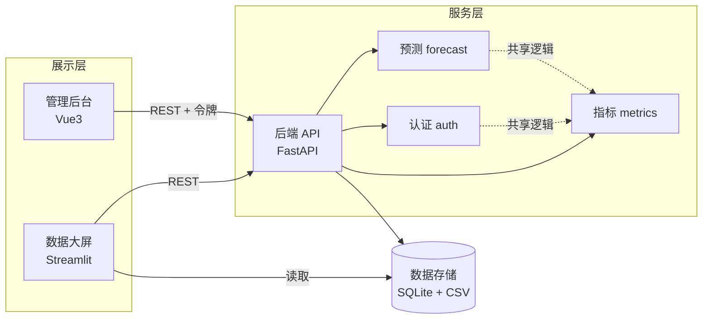

# 项目故事

> 按 STAR 组织：背景 → 任务 → 行动 → 结果。对外介绍时重点落在「预测与异常检测 / 数据质量」分析能力上。

## 一句话总结

我独立开发了一个「智慧政务数据分析平台」，包含管理后台（Vue3）、后端 API（FastAPI）、可选数据大屏（Streamlit），基于 5 万条 NYC 311 公开工单做清洗聚合与看板展示，实现登录鉴权与角色权限、Holt-Winters 办件量预测与 3-sigma 异常检测，并配套 63 个 pytest。

## 背景与问题（S / T）

政务数据普遍有三个痛点：

1. **数据分散**：办件、诉求、巡查、日志分散在不同系统，缺乏统一视角。
2. **只能事后统计，不能预判**：无法提前预测办件量波动，也无法自动识别异常激增。
3. **权限边界模糊**：管理员和普通办事员的功能差异不清晰。

## 数据

- **真实数据**：纽约市 311 热线工单（[NYC 311 Open Data](https://www.kaggle.com/datasets/sherinclaudia/nyc311-2010)，2010 年至今），字段含诉求类型、行政区、部门、受理 / 办结时间、状态；通过 `import_nyc311.py` 映射为项目的诉求 / 办件 / 部门 / 区域四张表。
- 存储同时落 **CSV + SQLite** 两种形态；数据层已解耦，可无缝替换为任意政务开放数据（如深圳 / 上海 12345 热线）。
- 另提供 `generate_data.py`（固定随机种子 42）作为无数据时的可复现模拟兜底。

## 方法（怎么做）

### 1. 时间序列预测 —— 技术深度的锚点

- 用 **Holt-Winters 加法季节指数平滑**（纯 numpy 实现、零第三方依赖）对办件量建模，包含**趋势项 + 周季节项**（周期 7 天），捕捉「工作日高、周末低」的规律。
- 按时间顺序留出最后 7 天，使用 **MAPE / WAPE / MAE / RMSE** 评估真实预测误差。
- 增加「上一周同日」季节性朴素基线，量化模型相对基线的提升，并用留出集 RMSE 给出未来 7 天参考区间。
- 方法演进：最初用「移动平均 + 线性回归」，难以刻画周内波动；改用 Holt-Winters 后用 MAPE / RMSE 对比评估——体现「发现问题 → 换方法 → 用指标验证」的分析闭环。

### 2. 异常检测

- 基于 Holt-Winters 拟合**残差**做 **3-sigma** 检测：先去除趋势与季节，再判断残差是否异常，避免把正常的高峰日误判为异常。

### 3. 前后端分离 + 三级权限

- 后端 FastAPI：PBKDF2 密码哈希 + HMAC 签名令牌，**公开 / 登录 / 管理员** 三级权限。
- 前端 Vue3：菜单 / 路由 / 按钮 / 接口 **四级权限**。
- 数据大屏 Streamlit：与后端**共享同一套指标与预测代码**（`shared/`），避免两处逻辑不一致。

## 结果（量化）

- NYC 311 抽样约 5 万条工单，映射为诉求 / 办件主题表；默认预测窗口的最后 7 天留出集 MAPE 14.22%、WAPE 14.01%、RMSE 139.30（随数据与窗口变化）。
- 数据质量：完整度约 99.36%，可识别 Unspecified 区域、重复诉求等问题。
- 63 个 pytest，覆盖 API 冒烟、权限隔离、用户启停、预测基线与参考区间。
- 权限：未登录 401、普通用户调管理接口 403；管理员可访问用户管理与工单处置。

## 反思与可改进（体现思考深度）

- 数据已接入 NYC 311 真实数据；可进一步替换为本地政务开放数据（深圳 / 上海 12345 热线），更贴合「智慧政务」主题。
- Holt-Winters 适合有周期性的数据；追求更高精度可换 ARIMA / Prophet（需引入 statsmodels / fbprophet）。
- 可引入外部特征（节假日、政策发布）提升预测准确率；异常检测可升级为孤立森林等无监督方法。

## 系统架构

